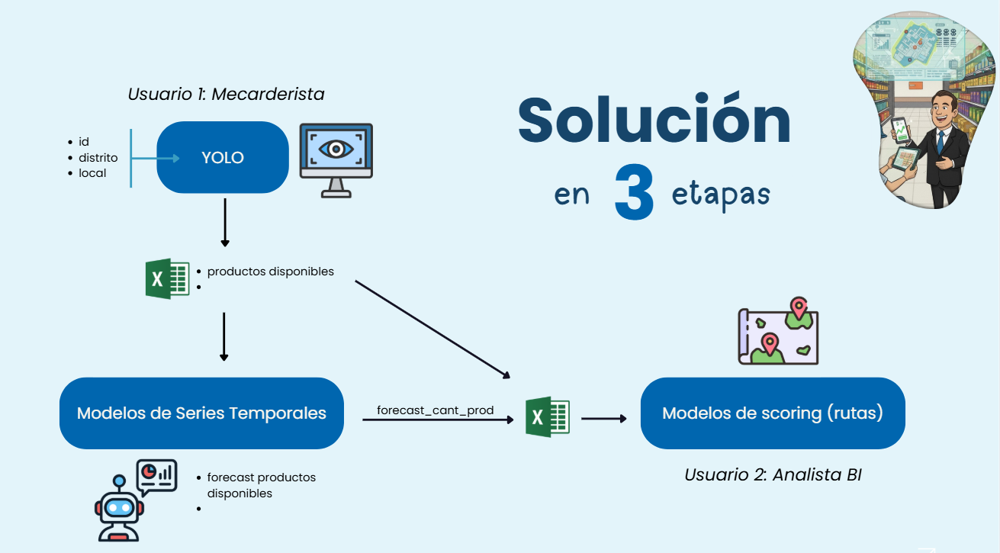

source proy_dpd/bin/activate

# 🛒 Smart Retail: Sistema Integral de Gestión de Góndolas
> **Detección de Objetos (OSA) | Predicción de Demanda | Ruteo Inteligente**

Este proyecto implementa una solución *end-to-end* para optimizar la gestión de inventario en tiendas minoristas (caso de uso: Tiendas Tambo). El sistema automatiza la auditoría de estanterías mediante visión por computadora, predice quiebres de stock futuros y genera rutas de visita optimizadas para los gestores de campo.

---

## 👥 Equipo del Proyecto
* **Johar:** Data Scientist & Business Specialist
* **Diego:** Data Engineer
* **Fabricio:** Data Analyst

---

## 🎯 Definición del Problema y Antecedentes

### Problema
Crear una plataforma que, impulsada por *computer vision*, pueda detectar y contar de forma automática los diferentes objetos (productos) en una imagen.

### Aplicación
En el manejo de inventario en supermercados, el objetivo es mantener un surtido adecuado en las góndolas. Para ello se captura una foto e instantáneamente se realiza el conteo, determinando el grado de completitud y la falta de surtido.
* **Alcance:** Como caso base, nos enfocaremos solo en el conteo general ("clase única"), es decir, no separaremos por categoría específica (lácteos, yogures, etc.), sino que evaluaremos la disponibilidad general frente al planograma.

### Antecedentes e Investigación
El proyecto se fundamenta en investigaciones previas sobre automatización en retail:
* **Algoritmos (YOLO):** Estudios concluyen que YOLO (You Only Look Once) es el más apropiado por su equilibrio velocidad-precisión para resolver problemas de falta de existencias. [ResearchGate: Object Detection in Shelf Images](https://www.researchgate.net/publication/335202398_Object_Detection_in_Shelf_Images_with_YOLO).
* **Referentes de Industria:** Empresas como **Neurolabs** utilizan visión sintética para la auditoría de estanterías y verificación de planogramas. [Neurolabs Blog](https://www.neurolabs.ai/post/what-does-the-future-of-retail-shelf-auditing-look-like-with-synthetic-computer-vision).
* **Metodología:** Se siguieron guías de Roboflow para el preprocesamiento y entrenamiento de modelos de detección en retail. [Roboflow Blog](https://blog.roboflow.com/retail-store-item-detection-using-yolov5/).

---

## 🛠️ Tech Stack & Herramientas

| Dominio | Tecnologías / Librerías |
| :--- | :--- |
| **Lenguaje Core** | `Python 3.10+` |
| **Computer Vision** | `Ultralytics YOLO (v11/v5)`, `OpenCV`, `Pillow` |
| **Data Wrangling** | `Pandas`, `NumPy`, `OpenPyXL` |
| **Machine Learning** | `Scikit-learn` (ExtraTreesRegressor, MultiOutputRegressor) |
| **Optimización** | `Pyomo` (Optimization Modeling), `Haversine` (Geo-cálculos) |
| **Visualización & UI** | `Streamlit` (Framework Web), `PyDeck` (Mapas 3D), `Matplotlib` |
| **Control de Versiones** | `Git`, `GitHub` |

---

## 🔄 Arquitectura y Flujo del Proyecto

La arquitectura sigue una estrategia de **Medallones (Bronze $\to$ Silver $\to$ Gold)** para garantizar la calidad del dato.

1.  **Input Visual:** Captura de imagen de la góndola.
2.  **Procesamiento:** Detección de productos (YOLO).
3.  **Almacenamiento:** Ingesta estructurada.
4.  **Predicción:** Estimación de disponibilidad futura.
5.  **Salida:** Ruteo óptimo.

---

## 📝 Desarrollo por Etapas 
### 1. Data Wrangling (Ingeniería de Datos)
* **Generación:** Diccionario maestro `stores_meta.py` y simulación histórica con estacionalidad semanal (`generar_hist_osa_sintetica_clean.py`).
* **Enriquecimiento:** Creación de *lags* (t-1, t-7) y medias móviles en `forecast_utec.py`.
* **Consolidación:** Integración de reglas de negocio (Estratos) en `genera_data_dummy.py`.

### 2. Modeling (Modelado)
* **Visión (YOLO):** Modelo entrenado para conteo agnóstico de objetos (`nc: 1`).
* **Forecast:** `ExtraTreesRegressor` con estrategia MultiOutput para predecir 7 días simultáneos, aplicando restricciones de capacidad.
* **Ruteo:** Algoritmo híbrido (Exacto/Heurístico) que minimiza la distancia ponderada por urgencia.

### 3. Prototyping (Aplicación)
La solución se materializa en una interfaz web unificada (`app.py`) desarrollada con **Streamlit**.

| Dashboard de Ruteo Geoespacial | Análisis y Proyección de Datos |
| :---: | :---: |
|  |  |
| *Visualización táctica de tiendas críticas (Rojo).* | *Detalle de métricas de disponibilidad.* |

---

## 📊 Especificaciones de Datos y Resultados 

### 4. Diccionario de Datos (Data Dictionary)
El flujo de datos sigue una arquitectura de medallones estricta. A continuación se detallan los esquemas de los archivos generados.

#### 🥉 Capa Bronze (Ingesta y Detección)
**Archivo:** `osa_hist_Tambo_UTEC.xlsx` / `osa_resultados.xlsx`
Contiene los registros históricos y las detecciones crudas del modelo YOLO.

| Columna | Tipo de Dato | Descripción | Ejemplo |
| :--- | :--- | :--- | :--- |
| `id` | String | Identificador único de la tienda (SKU/Local). | `TUB0001`, `TCL0001` |
| `local` | String | Nombre comercial del punto de venta. | "Tambo UTEC", "Tambo Cardenas" |
| `distrito` | String | Ubicación geográfica administrativa. | "Barranco", "Lince" |
| `latitud` / `longitud` | Float | Coordenadas geoespaciales (WGS84). | `-12.1358`, `-77.0225` |
| `productos disponibles`| Integer | **Output YOLO:** Cantidad de objetos detectados. | `22`, `25` |
| `productos esperados` | Integer | **Input Planograma:** Capacidad ideal de la góndola. | `35`, `21` |
| `osa` | Float | **KPI:** Disponibilidad ($\frac{Disp}{Esp} \times 100$). | `61.11`, `119.05` |
| `fecha` | Datetime | Marca temporal del registro. | `2024-01-01` |

#### 🥈 Capa Silver (Enriquecimiento y Forecast)
**Archivo:** `osa_hist_Tambo_UTEC_with_forecast.xlsx`
Extiende la capa Bronze con predicciones a futuro y variables temporales.

| Columna Adicional | Tipo | Descripción |
| :--- | :--- | :--- |
| `dow` | Integer | Día de la semana (feature temporal). |
| `pred_t+1` ... `pred_t+7`| Integer | Predicciones de stock para los siguientes 7 días. |

#### 🥇 Capa Gold (Priorización para Ruteo)
**Archivo:** `gold_tiendas_7d.xlsx`
Datos consolidados listos para el algoritmo de optimización.

| Columna | Descripción | Regla de Negocio |
| :--- | :--- | :--- |
| `estrato` | Char (A/B/C/D)| Nivel Socioeconómico o Prioridad Estratégica. |
| `osa` | Float | Se utiliza el OSA predicho más bajo de la ventana de 7 días. |

---

### 5. Especificaciones del Dataset (Entrenamiento YOLO)
Para el entrenamiento del modelo de visión computacional se utilizó el dataset **`bbox-retail` (v4 tiled)**, optimizado para entornos de retail.

* **Fuente:** Roboflow Universe.
* **Volumen de Datos:** 21,492 imágenes en total.
* **Pre-procesamiento Aplicado:**
    * *Auto-orientación:* Corrección de metadatos EXIF.
    * *Redimensionamiento:* 416x416 px (Stretch) para compatibilidad con YOLO.
    * *Contraste:* Ecualización adaptativa para manejar variaciones de iluminación.
* **Aumentación de Datos (Data Augmentation):**
    * Flip Vertical (50% probabilidad).
    * Rotación aleatoria (entre -10° y +10°).
    * Ajuste de exposición (±25%).

---

### 6. Análisis de Resultados (Caso de Estudio)

*Figura: Ejemplo de visualización de datos y proyecciones dentro de la plataforma.*

#### 6.1. Validación del Ruteo Inteligente
Se ejecutó el algoritmo de optimización (`web_ruteo.py`) utilizando los datos de la capa Gold. A continuación se presenta un caso de prueba real extraído de `ruta_sugerida.csv`.

* **Criterio:** Minimizar distancia ponderada por urgencia (Prioridad).

**Tabla de Resultados de la Optimización:**

| Orden | ID Tienda | Local | Distrito | Estrato | OSA (%) | Prioridad | Acción Logística |
| :--- | :--- | :--- | :--- | :--- | :--- | :--- | :--- |
| **1** | `TCLV0001` | Tambo Canada | La Victoria | **C** | 68.75% | **0.368** | **Visita Inmediata** (Bajo OSA + Estrato Medio) |
| **2** | `TUB0665` | Tambo UTEC | Barranco | B | 70.97% | 0.316 | Segunda parada (Ruta eficiente) |
| **3** | `TAM0001` | Tambo Angamos | Miraflores | A | 78.12% | 0.225 | Prioridad baja (Buen stock) |
| **4** | `TCL0001` | Tambo Cardenas | Lince | B | 72.41% | 0.298 | Visita de mantenimiento |
| **5** | `TMEA0001` | Tambo Mariategui| El Agustino | **D** | **63.33%**| **0.440** | **Alta Criticidad** (Optimizada por distancia) |

*Fuente: `ruta_sugerida.csv` generado por el sistema.*

**Interpretación:**
El sistema identificó correctamente a **Tambo Mariategui (Estrato D, OSA 63%)** como la tienda con mayor prioridad (0.440). Sin embargo, el algoritmo la colocó en la posición 5 debido a su ubicación geográfica lejana, demostrando el balance inteligente entre **Urgencia vs. Distancia Recorrida** para maximizar la eficiencia operativa.

#### 6.2. Desempeño del Forecast
El modelo `ExtraTreesRegressor` demostró capacidad para capturar la tendencia semanal, ajustando las predicciones del día $t+1$ basándose en los lags de $t-7$, lo que permite anticipar la demanda cíclica típica de los fines de semana.

---

### 7. Conclusiones del Proyecto
1.  **Automatización Efectiva:** La integración de YOLO v11 permite reducir el tiempo de auditoría de minutos a segundos, eliminando el error humano en el conteo manual.
2.  **Gestión Proactiva:** El módulo de *Forecasting* transforma la operación de reactiva a proactiva, permitiendo reabastecer tiendas antes de que ocurra el quiebre de stock (OSA < 70%).
3.  **Eficiencia Logística:** El algoritmo de ruteo no solo reduce kilómetros recorridos, sino que asegura que las tiendas más vulnerables (Estratos C/D con bajo stock) sean atendidas prioritariamente.

---
