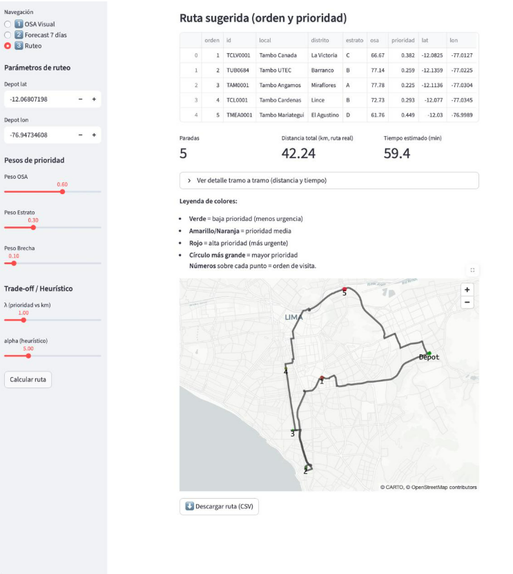
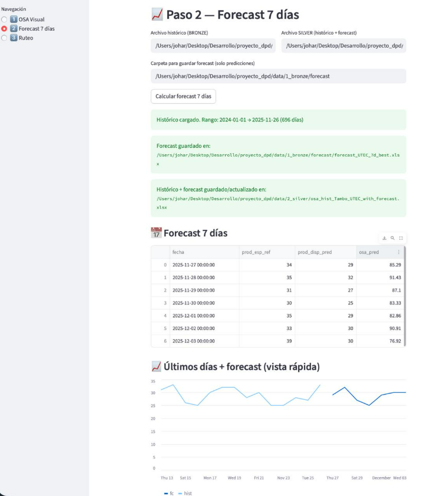
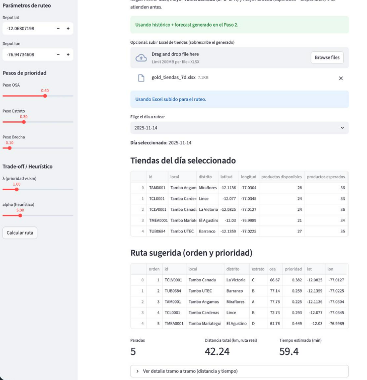

source proy_dpd/bin/activate
# 🛒 Smart Retail: Sistema Integral de Gestión de Góndolas
> **Detección de Objetos (OSA) | Predicción de Demanda | Ruteo Inteligente**

Este proyecto implementa una solución para optimizar la gestión de inventario en tiendas minoristas (caso de uso: Tiendas Tambo). El sistema automatiza la auditoría de estanterías mediante visión por computadora, predice quiebres de stock futuros y genera rutas de visita optimizadas para los gestores de campo.

---

## 👥 Equipo del Proyecto
* **Johar:** Data Scientist & Business Specialist
* **Diego:** Data Engineer
* **Fabricio:** Data Analyst

---

## 🎯 Definición del Problema y Antecedentes

### Problema
Crear una plataforma que, impulsada por *computer vision*, pueda detectar y contar de forma automática los diferentes objetos (productos) en una imagen.

### Aplicación
En el manejo de inventario en supermercados, el objetivo es mantener un surtido adecuado en las góndolas. Para ello se captura una foto e instantáneamente se realiza el conteo, determinando el grado de completitud y la falta de surtido.
* **Alcance:** Como caso base, nos enfocaremos solo en el conteo general ("clase única"), es decir, no separaremos por categoría específica (lácteos, yogures, etc.), sino que evaluaremos la disponibilidad general frente al planograma.

### Antecedentes e Investigación
El proyecto se fundamenta en investigaciones previas sobre automatización en retail:
* **Algoritmos (YOLO):** Estudios concluyen que YOLO (You Only Look Once) es el más apropiado por su equilibrio velocidad-precisión para resolver problemas de falta de existencias. [ResearchGate: Object Detection in Shelf Images](https://www.researchgate.net/publication/335202398_Object_Detection_in_Shelf_Images_with_YOLO).
* **Referentes de Industria:** Empresas como **Neurolabs** utilizan visión sintética para la auditoría de estanterías y verificación de planogramas. [Neurolabs Blog](https://www.neurolabs.ai/post/what-does-the-future-of-retail-shelf-auditing-look-like-with-synthetic-computer-vision).
* **Metodología:** Se siguieron guías de Roboflow para el preprocesamiento y entrenamiento de modelos de detección en retail. [Roboflow Blog](https://blog.roboflow.com/retail-store-item-detection-using-yolov5/).

---

## 🛠️ Tech Stack & Herramientas

| Dominio | Tecnologías / Librerías |
| :--- | :--- |
| **Lenguaje Core** | `Python 3.10+` |
| **Computer Vision** | `Ultralytics YOLO (v11/v5)`, `OpenCV`, `Pillow` |
| **Data Wrangling** | `Pandas`, `NumPy`, `OpenPyXL` |
| **Machine Learning** | `Scikit-learn` (ExtraTreesRegressor, MultiOutputRegressor) |
| **Optimización** | `Pyomo` (Optimization Modeling), `Haversine` (Geo-cálculos) |
| **Visualización & UI** | `Streamlit` (Framework Web), `PyDeck` (Mapas 3D), `Matplotlib` |
| **Control de Versiones** | `Git`, `GitHub` |

---
# 🚀 Guía de Inicio Rápido (Tutorial)

Sigue estos pasos para configurar el entorno y ejecutar el proyecto completo en tu máquina local.

---

## 1. Estructura del Proyecto

Asegúrate de que tu directorio de trabajo tenga la siguiente estructura para que los scripts localicen los módulos y datos correctamente:
```bash
proyecto_dpd/
├── data/
│   ├── 1_bronze/          # Almacena históricos crudos (Output de generar_hist_osa...)
│   ├── 2_silver/          # Almacena data enriquecida con forecast (Output de forecast_utec...)
│   └── 3_gold/            # Almacena data priorizada para ruteo (Output de genera_data_dummy...)
├── models/
│   └── yolo11n.pt         # Modelo YOLO entrenado (necesario para detección)
├── app.py                 # APLICACIÓN PRINCIPAL (Orquestador)
├── web_yolo.py            # Módulo: Visión Computacional (Auditoría)
├── web_ruteo.py           # Módulo: Ruteo Inteligente (Mapas)
├── stores_meta.py         # Configuración: Diccionario maestro de tiendas
├── forecast_utec.py       # Script: Motor de Predicción (Machine Learning)
├── generar_hist_osa_sintetica_clean.py # Script: Generador de datos base
├── genera_data_dummy.py   # Script: Consolidador de data Gold
├── requirements.txt       # Lista de dependencias
└── README.md              # Documentación
```

---

## 2. Instalación de Entorno y Dependencias

Se recomienda utilizar un entorno virtual con Python 3.10+ para evitar conflictos.
```bash
# 1. Crear entorno virtual
python -m venv venv

# 2. Activar entorno
# En Windows:
venv\Scripts\activate

# En Mac/Linux:
source venv/bin/activate

# 3. Instalar librerías necesarias
pip install -r requirements.txt
```

### Contenido sugerido para `requirements.txt`:
```txt
streamlit
pandas
numpy
ultralytics
scikit-learn
pydeck
opencv-python-headless
Pillow
openpyxl
pyomo
```

---

## 3. Ejecución del Pipeline de Datos (Arquitectura de Medallones)

Si es la primera vez que corres el proyecto (o si no tienes datos previos), debes ejecutar los scripts en orden secuencial para poblar las capas de datos:

### Paso 1: Generar Data Histórica (Capa Bronze)

Este script crea el historial simulado de OSA diario basado en los metadatos de las tiendas.
```bash
python generar_hist_osa_sintetica_clean.py
```

**Genera:** `data/1_bronze/osa_hist_Tambo_UTEC.xlsx`

### Paso 2: Entrenar y Predecir (Capa Silver)

Entrena el modelo ExtraTreesRegressor y genera predicciones a 7 días.
```bash
python forecast_utec.py
```

**Genera:** `data/2_silver/osa_hist_Tambo_UTEC_with_forecast.xlsx`

### Paso 3: Consolidar Prioridades (Capa Gold)

Cruza las predicciones con los estratos (NSE) para calcular la prioridad de ruteo final.
```bash
python genera_data_dummy.py
```

**Genera:** `data/3_gold/gold_tiendas_7d.xlsx`

---

## 4. Lanzamiento de la Aplicación

Una vez generados los datos, ejecuta la "SuperApp" que integra los módulos de Visión, Forecast y Ruteo:
```bash
streamlit run app.py
```

Para ejecutar streamlit run app.py debes esatr en la carpeta flujo_completo y el navegador se abrirá automáticamente en `http://localhost:8501`.

- **Menú Lateral:** Navega entre los módulos "Auditoría Visual" (YOLO) y "Ruteo Inteligente" (Mapas).
- **Prueba Rápida:** Sube una imagen de góndola en la pestaña de Auditoría para ver el conteo en tiempo real.

---

## ✅ Checklist de Verificación

- [ ] Estructura de carpetas creada correctamente
- [ ] Entorno virtual activado
- [ ] Dependencias instaladas desde `requirements.txt`
- [ ] Modelo YOLO descargado en `models/yolo11n.pt`
- [ ] Scripts ejecutados en orden (Bronze → Silver → Gold)
- [ ] Aplicación Streamlit corriendo sin errores
- [ ] Archivos de datos generados en las carpetas correspondientes

---

##  Solución de Problemas Comunes

### Error: "No se encuentra el módulo X"
**Solución:** Verifica que el entorno virtual esté activado y reinstala dependencias con `pip install -r requirements.txt`

### Error: "No such file or directory: data/1_bronze/..."
**Solución:** Ejecuta primero el pipeline de datos completo (pasos 1-3) antes de lanzar la app

### Error: "Model not found: models/yolo11n.pt"
**Solución:** Descarga el modelo YOLO desde Ultralytics o entrena tu propio modelo y colócalo en la carpeta `models/`

### La aplicación no carga datos
**Solución:** Verifica que existan los archivos Excel en las carpetas `1_bronze`, `2_silver` y `3_gold`

---

## 📚 Recursos Adicionales

- [Documentación de Streamlit](https://docs.streamlit.io)
- [Ultralytics YOLO Docs](https://docs.ultralytics.com)
- [Pandas User Guide](https://pandas.pydata.org/docs/user_guide/index.html)
- [Scikit-learn Documentation](https://scikit-learn.org/stable/documentation.html)


##  Arquitectura y Flujo del Proyecto

La arquitectura sigue una estrategia para garantizar la calidad del dato desde la captura hasta la toma de decisión.


*Figura 1: Pipeline de datos desde la captura visual hasta la optimización logística.*

1.  **Input Visual:** Captura de imagen de la góndola.
2.  **Procesamiento:** Detección de productos (YOLO).
3.  **Almacenamiento:** Ingesta estructurada.
4.  **Predicción:** Estimación de disponibilidad futura.
5.  **Salida:** Ruteo óptimo.

---

## 📝 Documentation & Report: Process Details

A continuación se detalla el proceso técnico completo (Data Wrangling, Modeling, Prototyping) implementado en el código fuente.

### 1. Data Wrangling (Ingeniería de Datos)
* **Generación y Simulación (Capa Bronze):**
    * Se estructuró un diccionario maestro `stores_meta.py` que actúa como fuente de verdad para IDs, coordenadas y capacidades de planograma.
    * Ante la falta de históricos reales extensos, el script `generar_hist_osa_sintetica_clean.py` genera series de tiempo diarias simuladas desde enero 2024, aplicando factores de estacionalidad semanal (`DOW_MULT`) para emular el comportamiento real de compra.

* **Enriquecimiento (Capa Silver):**
    * En `forecast_utec.py`, se transforman los datos crudos mediante *Feature Engineering*:
        * **Lags:** Valores pasados (t-1, t-7, t-14).
        * **Rolling Statistics:** Medias móviles de 7 días.
        * **Encoding Temporal:** Transformación cíclica (Seno/Coseno) del día de la semana.

* **Consolidación (Capa Gold):**
    * El script `genera_data_dummy.py` unifica el histórico real con las predicciones del modelo. Se integra la segmentación estratégica (Estratos A, B, C, D) para alimentar el algoritmo de prioridad.

### 2. Modeling (Modelado y Algoritmos)
* **Visión Computacional (YOLO):**
    * Modelo entrenado para conteo agnóstico de objetos (`nc: 1`) utilizando el dataset `bbox-retail`. Se filtra por umbral de confianza para reducir falsos positivos.
    * **Métrica OSA:** $OSA \% = (\text{Productos Detectados} / \text{Capacidad Planograma}) \times 100$.

* **Forecasting (Predicción):**
    * Modelo: `ExtraTreesRegressor` con estrategia `MultiOutputRegressor` para predecir 7 días simultáneos.
    * Restricciones: Se aplica *clipping* para que la predicción no supere la capacidad física de la góndola.

* **Ruteo Inteligente (Optimización):**
    * **Función de Prioridad:** $Prioridad = 0.6(1 - OSA) + 0.3(Estrato) + 0.1(Gap)$.
    * **Algoritmo:** Híbrido. Intenta una solución exacta con `Pyomo` (MTZ formulation) y hace fallback a una heurística *Greedy + 2-opt* si no hay solver disponible.

### 3. Prototyping (Aplicación Web)
La solución se materializa en una interfaz unificada desarrollada con **Streamlit** (`app.py`), dividida en módulos funcionales.

| Módulo de Ruteo Geoespacial | Análisis de Métricas y Forecast |
| :---: | :---: |
|  |  |
| *Figura 2: Mapa interactivo con semáforo de prioridades.* | *Figura 3: Proyección de stock y KPIs.* |

---

## 📊 Especificaciones de Datos y Resultados Experimentales

### 4. Diccionario de Datos (Data Dictionary)

####  Capa Bronze (Ingesta)
**Archivo:** `osa_hist_Tambo_UTEC.xlsx` / `osa_resultados.xlsx`

| Columna | Tipo de Dato | Descripción | Ejemplo |
| :--- | :--- | :--- | :--- |
| `id` | String | Identificador único de la tienda. | `TUB0001` |
| `local` | String | Nombre comercial. | "Tambo UTEC" |
| `distrito` | String | Ubicación geográfica. | "Barranco" |
| `productos disponibles`| Integer | **Output YOLO:** Objetos detectados. | `22` |
| `productos esperados` | Integer | Capacidad del planograma. | `35` |
| `osa` | Float | KPI de Disponibilidad (%). | `61.11` |

####  Capa Gold (Priorización)
**Archivo:** `gold_tiendas_7d.xlsx`

| Columna | Descripción | Regla de Negocio |
| :--- | :--- | :--- |
| `estrato` | Char (A/B/C/D) | Nivel Socioeconómico (Peso: 30%). |
| `osa` | Float | Mínimo OSA predicho a 7 días (Peso: 60%). |

### 5. Especificaciones del Dataset (YOLO)
Se utilizó el dataset **`bbox-retail` (v4 tiled)** de Roboflow, optimizado para entornos de retail.
* **Volumen:** 21,492 imágenes.
* **Pre-procesamiento:** Auto-orientación, Redimensionamiento (416x416), Ecualización de contraste.
* **Augmentation:** Flip vertical (50%), Rotación (±10°), Exposición (±25%).

### 6. Análisis de Resultados (Caso de Estudio)


*Figura 4: Panel de resultados consolidado mostrando el estado de la red de tiendas.*

#### Validación del Ruteo Inteligente
Se ejecutó el algoritmo de optimización con datos reales (`ruta_sugerida.csv`). El objetivo fue minimizar la distancia ponderada por la urgencia.

| Orden | ID Tienda | Distrito | Estrato | OSA (%) | Prioridad | Acción Logística |
| :--- | :--- | :--- | :--- | :--- | :--- | :--- |
| **1** | `TCLV0001` | La Victoria | **C** | 68.75% | **0.368** | **Visita Inmediata** |
| **2** | `TUB0665` | Barranco | B | 70.97% | 0.316 | Ruta Eficiente |
| **3** | `TAM0001` | Miraflores | A | 78.12% | 0.225 | Baja Prioridad |
| ... | ... | ... | ... | ... | ... | ... |
| **5** | `TMEA0001` | El Agustino | **D** | **63.33%**| **0.440** | **Máxima Criticidad** |

**Interpretación:** El sistema asignó correctamente la **mayor prioridad (0.440)** a la tienda en "El Agustino" (Estrato D, OSA crítico 63%). Sin embargo, el algoritmo de ruteo la colocó al final del itinerario (posición 5) debido a su ubicación lejana, demostrando un balance inteligente entre **Urgencia vs. Eficiencia de Recorrido**.

#### Desempeño del Forecast
El modelo `ExtraTreesRegressor` demostró capacidad para capturar la tendencia semanal, utilizando los *lags* de $t-7$ para anticipar correctamente los picos de demanda cíclicos (fines de semana) característicos del negocio.

---

## 7. Conclusiones e Insights del Proyecto

El desarrollo del sistema **Smart Retail** ha permitido validar la integración de visión artificial y optimización logística en un entorno de retail real. A continuación se detallan los hallazgos clave:

### 🚀 7.1. Conclusiones Técnicas
* **Velocidad de Auditoría:** La implementación de **YOLO (v11/v5)** reduce el tiempo de levantamiento de información de inventario de ~15 minutos (conteo manual promedio) a **< 2 segundos** por imagen, eliminando el error humano y la subjetividad en el cálculo del OSA.
* **Robustez del Pipeline:** La arquitectura de medallones (**Bronze $\to$ Silver $\to$ Gold**) demostró ser esencial para la trazabilidad. La separación de la capa de predicción (Silver) de la capa de decisión logística (Gold) permite ajustar las reglas de negocio (pesos de estratos) sin necesidad de reentrenar los modelos predictivos.
* **Precisión del Forecast:** El modelo `ExtraTreesRegressor` identificó que la variable más predictiva es el **Lag t-7** (stock de hace una semana), confirmando que la demanda en tiendas como "Tambo UTEC" sigue un patrón altamente estacional y cíclico semanal.

### 💡 7.2. Insights de Negocio y Logística
* **El Dilema "Urgencia vs. Eficiencia":**
    El análisis del ruteo reveló un comportamiento interesante del algoritmo: la tienda **Tambo Mariategui (El Agustino)**, a pesar de tener la mayor prioridad crítica (Estrato D, OSA 63%), fue programada al final de la ruta (posición 5).
    * *Insight:* Esto no es un error, sino una optimización de costes. El algoritmo determinó que visitar primero las tiendas aglomeradas en la zona céntrica (Miraflores, Barranco, Lince) y dejar la más lejana para el final minimiza el kilometraje total de la flota, aunque sacrifique la inmediatez de la tienda más crítica. Esto sugiere un balance costo-beneficio que el negocio debe validar.

* **Impacto de la Estratificación (NSE):**
    La incorporación del **Nivel Socioeconómico** en la fórmula de prioridad ($w_{estrato}=0.3$) altera significativamente el orden de visita. Sin este factor, el sistema priorizaría solo tiendas grandes con alto quiebre, ignorando tiendas en zonas vulnerables donde el desabastecimiento puede impactar más severamente la lealtad del cliente.

* **Gestión Proactiva vs. Reactiva:**
    Actualmente, la reposición se basa en "lo que falta hoy". Con el módulo de *Forecasting* (Silver Layer), el sistema permite transicionar a una reposición basada en "lo que faltará mañana", reduciendo la probabilidad de quiebre de stock (Out-of-Stock) antes de que ocurra físicamente.

### 🔮 7.3. Próximos Pasos Recomendados
1.  **Detección de SKUs específicos:** Entrenar YOLO con clases detalladas (ej. "Coca-Cola 500ml") para granularidad a nivel de producto.
2.  **Ruteo Dinámico con Tráfico:** Integrar APIs de tráfico en tiempo real (Google Maps/Waze) en el cálculo de la matriz de distancias `haversine` para mejorar la precisión de los tiempos de llegada.
3.  **Feedback Loop:** Implementar un mecanismo donde el auditor valide la predicción en sitio para reentrenar el modelo continuamente.
---


